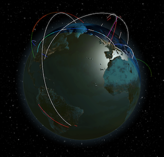

<p align="center">
  
</p>
<p align="center">
  <a href="https://github.com/AlexGustafsson/pewview/blob/master/go.mod">
    
  </a>
  <a href="https://github.com/AlexGustafsson/pewview/releases">
    
  </a>
  <br>
  <strong><a href="#quickstart">Quick Start</a> | <a href="#contribute">Contribute</a> </strong>
</p>

# PewView
### A self-hosted network visualization on a 3D globe with support for IPFIX, NetFlow, sFlow and more

⚠️ PewView is currently being actively developed. Until it reaches v1.0.0 breaking changes may occur in minor versions.

PewView is a self-hosted network visualization tool. It listens for incoming network traffic flow in the commonly used [IPFix (NetFlow v9)](https://en.wikipedia.org/wiki/IP_Flow_Information_Export), [NetFlow v5](https://en.wikipedia.org/wiki/NetFlow) and [sFlow](https://en.wikipedia.org/wiki/SFlow) formats, as well as a simple HTTP-based API endpoint. The traffic data is condensed, anonymized and enriched by adding location data to the observed network connections. The network traffic is then exported in a simple API. A web-based frontend then uses the API to visualize the network traffic in realtime on a 3D globe, shown in the picture above.

## Quickstart
<a name="quickstart"></a>

The service comes in two parts, an optional frontend and a high-throughput server based on [Cloudflare's goflow](https://github.com/cloudflare/goflow).

Whilst the two are intended to be used together, one may chose to deactivate the frontend in order to use PewView as a high-throughput consumer of IPFIX, NetFlow, sFlow and more.

First, download [the latest release](https://github.com/AlexGustafsson/pewview/releases) for your architecture.

You'll also need a GeoIP service to enable PewView to resolve IP addresses to locations. For instructions on setting some of them up, see [IP Geolocation configuration](#geoip). A free service without config values is used in the example below.

The service can now be started like so:

```shell
pewview --consumer=netflow --location-provider=ipapi
```

PewView is incredibly configurable, please refer to the documentation below for instructions on how to use other conumers and location providers.

## Table of contents

[Quickstart](#quickstart)<br/>
[Features](#features)<br />
[Installation](#installation)<br />
[Usage](#usage)<br />
[Contributing](#contributing)

<a id="features"></a>
## Features

* Intuitive web interface with a 3D visualization
* High performance and scalable consumer
* Supports NetFlow v5, Netflow v9 / IPFIX, sFlow and more
* Stateless and usable via a single Docker container
* Supports many location providers, offline, online, free and paid

<a id="installation"></a>
## Installation

### Using Homebrew

```sh
brew install alexgustafsson/tap/pewview
```

### Downloading a pre-built release

Download the latest release from [here](https://github.com/AlexGustafsson/pewview/releases).

### Build from source

Clone the repository.

```sh
git clone https://github.com/AlexGustafsson/pewview.git && cd pewview
```

Optionally check out a specific version.

```sh
git checkout v0.2.0
```

Build the application and frontend.

```sh
make build
```

## Usage
<a name="usage"></a>

_Note: This project is still actively being developed. The documentation is an ongoing progress._

```shell
# Run PewView, listening for incoming IPFix (Netflow v9) data, getting location data from ipapi.io
pewview --consumer ipfix --location-provider ipapi

# Lookup some addresses using the configured location provider(s)
pewview --location-provider ipapi --lookup-address <ip>
```

```
Usage:
  pewview [OPTIONS]

Application Options:
      --lookup-address=                               Print the location of the address and exit. May be used more than once
      --consumer=[ipfix|netflow|sflow|webhook|random] Enable a consumer. May be used more than once
      --geo=[geolite|ipgeolocation|ipapi|file]        Enable a location provider. May be used more than once

Logging:
      --log.level=[debug|info|warn|error]             Log level (default: info)

IPFix Consumer:
      --consumer.ipfix.address=                       Listening address (default: <unset>)
      --consumer.ipfix.port=                          Listening port (default: 2055)
      --consumer.ipfix.workers=                       Worker count (default: 1)

Netflow Consumer:
      --consumer.netflow.address=                     Listening address (default: <unset>)
      --consumer.netflow.port=                        Listening port (default: 2056)
      --consumer.netflow.workers=                     Worker count (default: 1)

SFlow Consumer:
      --consumer.sflow.address=                       Listening address (default: <unset>)
      --consumer.sflow.port=                          Listening port (default: 6343)
      --consumer.sflow.workers=                       Worker count (default: 1)

WebHook Consumer:
      --consumer.webhook.address=                     Listening address (default: <unset>)
      --consumer.webhook.port=                        Listening port (default: 8081)

GeoLite Location Provider:
      --geo.geolite.path=                             Path to GeoLite2-City.mmdb

ipgeolocation.io Location Provider:
      --geo.ipgeolocation.key=                        API key [$PEWVIEW_IPGEOLOCATION_KEY]

File-based Location Provider:
      --geo.file.path=                                Path to JSON file containing patterns and locations

Web:
      --web.disable                                   Disable the built-in web interface
      --web.address=                                  Listening address (default: <unset>)
      --web.port=                                     Listening port (default: 8080)
      --web.origin=                                   Origin to allow (default: *)

Pipeline:
      --pipeline.queue=                               Length of the pipeline's message queue (default: 1024)

Metrics Tuning:
      --metrics.window=                               Duration of a window (default: 1m)

Metrics to Expose:
      --metrics.expose.bytes                          Expose number of bytes sent in a connection
      --metrics.expose.source-address                 Expose source address of a connection
      --metrics.expose.source-port                    Expose source port of a connection
      --metrics.expose.destination-address            Expose destination address of a connection
      --metrics.expose.destination-port               Expose destination port of a connection

Prometheus:
      --prometheus.enable                             Enable /metrics endpoint

Help Options:
  -h, --help                                          Show this help message
```

## IP Geolocation configuration
<a name="geoip"></a>

### MaxMind's GeoLite2 (free, paid, offline)

MaxMind's database is available offline, either free or paid. The paid version comes with more and newer data.

1. Create a free account on [https://dev.maxmind.com/geoip/geoip2/geolite2/](https://dev.maxmind.com/geoip/geoip2/geolite2/)
2. Log in and go to the Download Files page under GeoIP2 / GeoLite 2
3. Right click on Download GZIP of the GeoLite2 City row and copy the link
4. Download the file using `wget --output-document geoip.gzip "<copied path>"`
5. Untar the file using `mkdir -p data/GeoLite && tar --strip=1 --directory data/GeoLite -xzvf geoip.gzip`

For evaluation, you can download test data from [maxmind/MaxMind-DB](https://github.com/maxmind/MaxMind-DB/blob/c46c33c3c598c648013e2aa7458f8492f4ecfcce/test-data/GeoIP2-City-Test.mmdb) and follow the same procedures as above.

Specify `--location-provider=geolite --geolite.path=./data/GeoLite/GeoLite2-City.mmdb` when starting PewView.

### ipgeolocation.io (free, paid, online)

The [ipgeolocation.io](https://ipgeolocation.io) service has a free tier offering 1K requests a day, 30K a month. There are alternatives for up to 20M requests a month.

1. Create an account on [https://ipgeolocation.io](https://ipgeolocation.io)
2. Log in to get your API key

Specify `--location-provider=ipgeolocation --ipgeolocation.key=<key>` when starting PewView. The key can also be set in the `PEWVIEW_IPGEOLOCATION_KEY` environment variable.

### ip-api.com (free, online)

The [ip-api.com](https://ip-api.com) service is free, but it is served over HTTP and limited to 40 requests per minute. The paid alternative is currently not supported.

Specify `--location-provider=ipapi` when starting PewView.

## Contributing
<a name="contributing"></a>

Any help with the project is more than welcome. The project is still in its infancy and not recommended for production.

### Development

```sh
# Clone the repository
https://github.com/AlexGustafsson/pewview.git && cd pewview

# Show available commands
make help

# Build the project for the native target
make build
```

_Note: due to a bug (https://gcc.gnu.org/bugzilla/show_bug.cgi?id=93082, https://bugs.llvm.org/show_bug.cgi?id=44406, https://openradar.appspot.com/radar?id=4952611266494464), clang is required when building for macOS. GCC cannot be used. Build the server like so: `CC=clang make server`._

### Contributors

This project was made possible by [Cloudflare's goflow](https://github.com/cloudflare/goflow) which is used for consuming network traffic.
